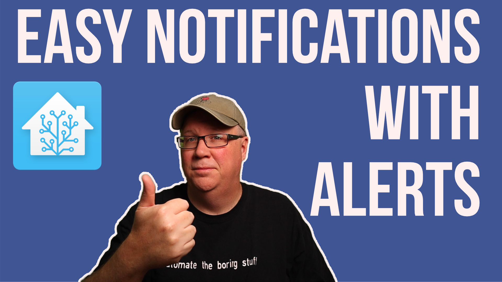

<h1>Home Assistant Alerts</h1>
 

<h2>Files You Need</h2>

**configuration.yaml** 

Contains information on setting up both the link to alerts.yaml and the notifiy service if you want to use text to speech with your alerts. 

**alerts.yaml** 

Contains alerts.

**automations.yaml**

Contains example Automations used in the examples to show how to use an automation to manage your alerts.

    

