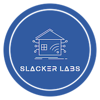

<h1>Notification Recall System</h1>
 

<h2>Files You Need</h2>

**configuration.yaml** 

Contains sensors for those not wanting to use the package

**scripts.yaml**

Contains scripts used for the speech engine and for the playing of the stored message. 

**packages/notifications.yaml**

Contains everything you need. If you grab this besure to add the package line under http to your config. 

    

