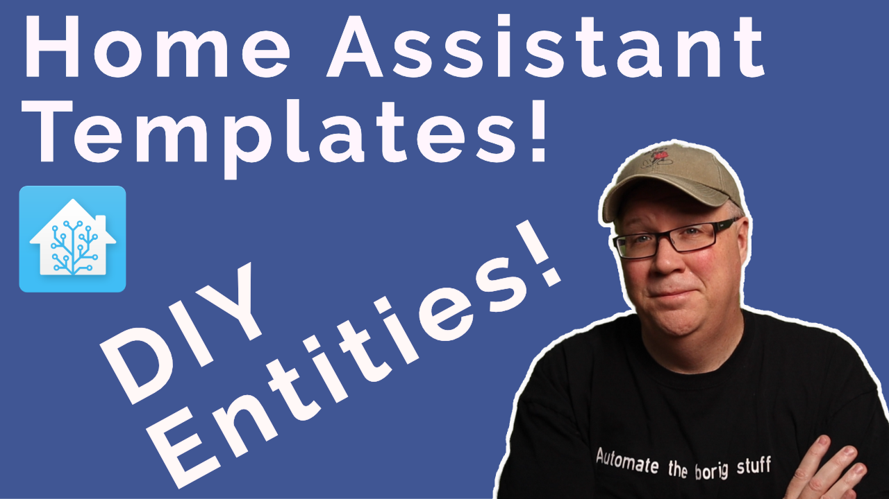

<h1>Master Home Assistant Templates: State Based Templates</h1>
 

This is a repo of all the YAML mentioned in the video. 

<h2>Files You Need</h2>

**configuration.yaml**

Contains the template directive

**template.yaml**

Contains the our template defined entities

**script.yaml**

The scripts referenced in the video just for, well, reference.

    

