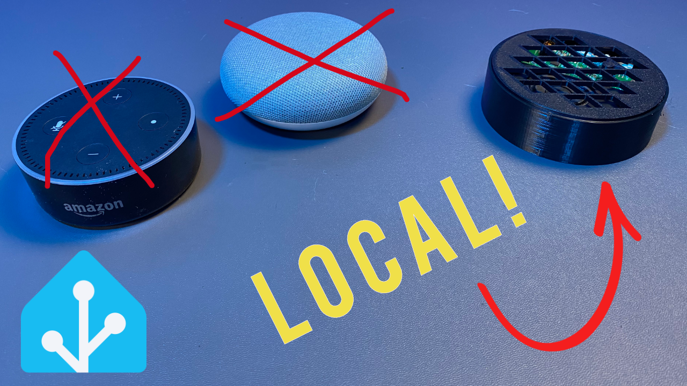

<h1>Local Voice Assistant Config</h1>
 

This is a repo of all the YAML mentioned in the video. 

<h2>Files You Need</h2>

**configuration.yaml**

Contains converstion and intent_script examples

**automation.yaml**

Contains example of voice Automations:

